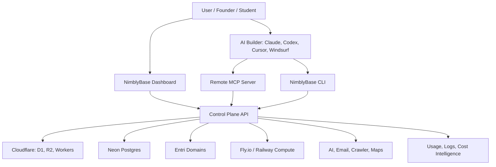

# NimblyBase

Agent-native backend and deployment control plane for AI-built apps.

NimblyBase helps AI coding agents move applications from demo to production. It exposes backend infrastructure through MCP, CLI, dashboard, and reusable Skills so agents can provision, deploy, verify, and monitor real app infrastructure.

## GOAI 2026 Submission

This repository is being prepared for the **GOAI Global Open-source AI Challenge**, **Agent Infra** track.

### Preliminary Project Introduction

NimblyBase is an open-source agent-native backend and deployment control plane for AI-built apps. Through MCP, CLI, and reusable Skills, multiple agents can plan, provision, deploy, and verify database, auth, storage, edge functions, domains, logs, and cost controls. It turns AI-generated demos into runnable, auditable, production-ready projects with reusable infrastructure patterns.

## Why This Matters

AI coding tools can generate app code quickly, but builders still struggle with production infrastructure:

- database setup
- authentication
- file storage
- edge functions and webhooks
- deployment
- domains and SSL
- environment variables
- logs and usage
- provider cost control

NimblyBase gives AI agents one safe control plane to operate these services.

## Core Concept



## Proposed Agent Loop

NimblyBase is designed around a three-agent closed loop:

1. **Product Agent**  
   Converts a rough app idea into schema, services, deployment, and domain requirements.

2. **Infrastructure Agent**  
   Uses NimblyBase MCP tools to provision database, auth, storage, edge functions, deployment, and domains.

3. **Verification Agent**  
   Checks logs, cost, security-sensitive operations, DNS, SSL, deployment status, and produces an evidence report.

## Planned Services

| Area | Initial Provider / Runtime |
|---|---|
| Light database | Cloudflare D1 |
| Postgres database | Neon |
| Storage | Cloudflare R2 |
| Edge functions | Cloudflare Workers for Platforms |
| Frontend / edge deployment | Cloudflare Workers for Platforms |
| Long-running compute | Fly.io first, Railway later |
| Domains | Entri Sell / Entri Connect |
| AI APIs | OpenRouter or direct provider gateway |
| Email | Resend / Postmark first, SES later |
| Web crawler | Apify first |
| Maps | Mapbox + Leaflet |
| Usage and cost intelligence | NimblyBase ledger and admin dashboard |

## Repository Status

This repository currently contains the initial submission materials and architecture plan. MVP implementation will be added in phases.

Current materials:

- [Concept demo site](apps/demo-site)
- [GOAI preliminary submission notes](docs/GOAI_PRELIMINARY_SUBMISSION.md)
- [Project overview](docs/PROJECT_OVERVIEW.md)
- [Architecture](docs/ARCHITECTURE.md)
- [Roadmap](docs/ROADMAP.md)
- [Open-source plan](docs/OPEN_SOURCE_PLAN.md)
- [SRS draft](docs/NimblyBase-SRS.md)
- [Pitch deck](submissions/goai-2026/NimblyBase-GOAI-Agent-Infra-Pitch.pptx)

## Demo URL

The concept demo is prepared for GitHub Pages.

Expected URL after GitHub Pages deployment:

```text
https://jvvinoth.github.io/nimblybase/
```

If GitHub Pages is not enabled yet, open the repository settings and set Pages to use **GitHub Actions**.

## Planned Monorepo Layout

```text
apps/
  control-plane-api/
  dashboard/
  docs/
  marketing/
  mcp-server/
  admin/
packages/
  cli/
  sdk-js/
  shared-types/
  ui/
infra/
  cloudflare/
  neon/
  terraform/
docs/
submissions/
```

## License

Apache-2.0. See [LICENSE](LICENSE).
