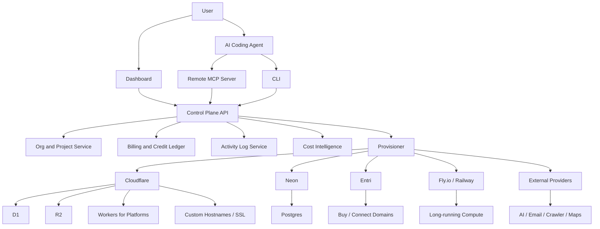
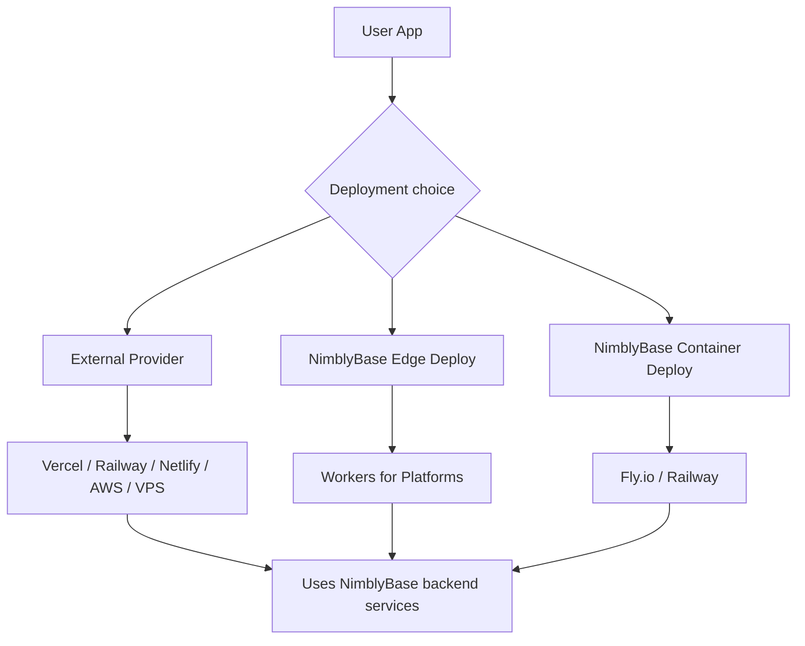
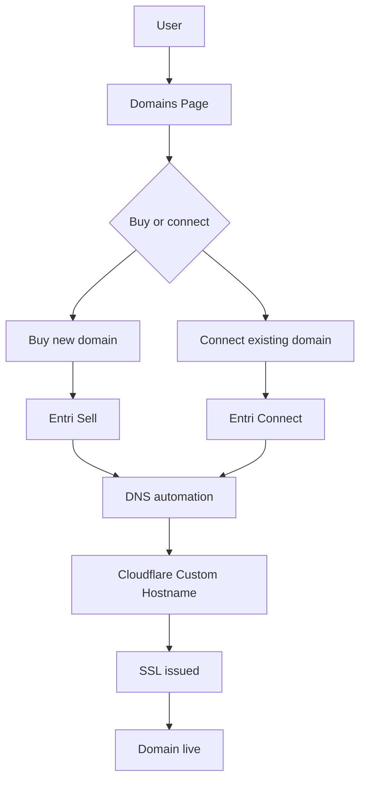

# Architecture

## Full System View

## Core Services

| Service | Responsibility |
|---|---|
| Control Plane API | Main API for dashboard, CLI, MCP, and project operations |
| Project Service | Organizations, projects, keys, environments, provider mapping |
| Provisioner | Idempotent provider operations across Cloudflare, Neon, Entri, Fly/Railway |
| Database Service | D1 and Neon provisioning, schema, migrations, metadata |
| Storage Service | R2 buckets, signed URLs, file metadata |
| Function Service | Edge function deployment, secrets, routes, cron |
| Deployment Service | Edge frontend deployment and container deployment |
| Domain Service | Entri Sell, Entri Connect, Cloudflare custom hostname, SSL |
| Usage Service | Usage events, provider cost events, credit deduction |
| Admin Service | Internal super dashboard and support tools |
| MCP Server | Agent-facing infrastructure tools |
| CLI | Local developer and agent command surface |

## Deployment Strategy

## Domain Strategy

## Provider Strategy

| Need | Provider |
|---|---|
| Light DB | Cloudflare D1 |
| Production Postgres | Neon |
| Storage | Cloudflare R2 |
| Edge functions | Cloudflare Workers for Platforms |
| Static/edge deployment | Cloudflare Workers for Platforms |
| Long-running compute | Fly.io first, Railway later |
| Domains | Entri |
| AI gateway | OpenRouter/direct providers |
| Email | Resend/Postmark first, SES later |
| Web crawler | Apify first |
| Maps | Mapbox |

