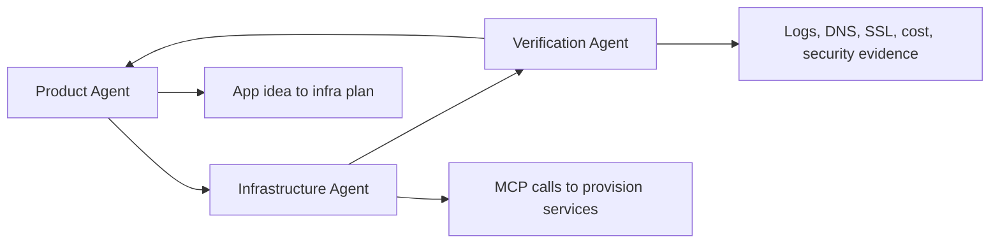

# GOAI 2026 Preliminary Submission

Track: **Agent Infra**  
Project: **NimblyBase**  
Status: Preliminary submission package

## 500-Character Project Introduction

NimblyBase is an open-source agent-native backend and deployment control plane for AI-built apps. Through MCP, CLI, and reusable Skills, multiple agents can plan, provision, deploy, and verify database, auth, storage, edge functions, domains, logs, and cost controls. It turns AI-generated demos into runnable, auditable, production-ready projects with reusable infrastructure patterns.

## Submission Positioning

NimblyBase should be submitted as **Agent Infra**, not as a generic backend-as-a-service.

The project focuses on:

- multi-agent task decomposition
- infrastructure tool calling through MCP
- reusable Skills for backend and deployment operations
- runtime verification
- execution evidence capture
- audit logs
- cost and usage observability
- safe approval and rollback flows

## Proposed Three-Agent Demo

### Agent 1: Product Agent

The Product Agent converts a rough application idea into a backend and deployment plan:

- database schema
- auth requirements
- storage needs
- edge function routes
- deployment target
- domain requirements
- cost constraints

### Agent 2: Infrastructure Agent

The Infrastructure Agent uses NimblyBase MCP tools and CLI commands to provision:

- Cloudflare D1 database
- Cloudflare R2 storage
- edge functions
- deployment target
- environment variables
- optional Neon Postgres
- optional Entri domain flow

### Agent 3: Verification Agent

The Verification Agent checks:

- deployment status
- function logs
- API health
- DNS status
- SSL status
- usage and cost
- security-sensitive operations
- error and rollback evidence

## Preliminary Deliverables

Required:

- project introduction
- proposal deck

Optional:

- repository link
- executable package placeholder
- architecture/SRS docs

This repository contains the public-facing submission materials and implementation plan.

## Semi-Final MVP Plan

If selected, the semi-final MVP should prove a narrow but complete closed loop:

1. User enters an app idea.
2. Product Agent creates an infrastructure plan.
3. Infrastructure Agent provisions D1, R2, and an edge function.
4. NimblyBase deploys a sample frontend or edge route.
5. Verification Agent produces logs, cost, and deployment evidence.

Expected demo output:

- live project URL
- project metadata
- database schema
- deployed edge function
- logs
- usage events
- cost ledger entry
- evidence report

