# NimblyBase Software Requirements Specification

Version: 0.1  
Date: 2026-08-14  
Status: Planning Draft  
Owner: NimblyBase Product Team

---

## Document Control

| Field | Value |
|---|---|
| Product Name | NimblyBase |
| Document Type | Software Requirements Specification |
| Primary Goal | Define the end-to-end product, platform architecture, services, pricing model, deployment model, domain service, dashboard, super admin, CLI, MCP, and execution roadmap |
| Intended Audience | Founders, product team, engineering team, design team, DevOps, finance, support, and future investors |
| Source Context | Inspired by agent-native backend platforms such as InsForge, but designed as a Cloudflare-first modular platform with Neon Postgres, Entri domains, and plug-and-play services |

---

## Table of Contents

1. Product Summary
2. Business Objective
3. Product Positioning
4. User Personas
5. Full System Architecture
6. Service Catalog
7. Deployment Strategy
8. Domain Service With Entri
9. Database Strategy
10. Edge Functions and Compute Strategy
11. MCP and CLI Strategy
12. Customer Dashboard Requirements
13. Super Admin Dashboard Requirements
14. Billing, Credits, and Cost Intelligence
15. Microservice Architecture
16. Microservice Flows
17. Security Requirements
18. Reliability and Scalability Requirements
19. Design System and Brand Direction
20. Marketing Site Requirements
21. Documentation Requirements
22. GitHub, CI/CD, and Engineering Process
23. Sprint Plan
24. Acceptance Criteria
25. Open Decisions

---

## 1. Product Summary

NimblyBase is a plug-and-play backend, deployment, domain, and cost intelligence platform for users building applications with AI coding tools such as Claude, Codex, Cursor, Windsurf, and similar agents.

The platform allows users to create a project and immediately use managed backend services without manually setting up infrastructure. Users can choose only the services they need. NimblyBase should not force users to host everything inside the platform.

Core promise:

> Your AI agent builds the app. NimblyBase gives it the backend, deployment, domain, and cost control.

Primary services:

- Cloudflare D1 database for light projects
- Neon Postgres for production-ready Postgres projects
- Authentication
- Storage for images and files
- Edge functions
- AI API gateway
- Web crawler
- Email service
- Maps integration
- Domain purchase, connection, DNS automation, and monitoring through Entri
- Deployment for frontend, edge, and container-based apps
- MCP server and CLI for agent-native workflows
- Customer dashboard
- Internal super admin dashboard for cost and usage intelligence

---

## 2. Business Objective

NimblyBase should solve the most common problem faced by AI-assisted builders:

> AI tools can generate code, but users still struggle with backend setup, database setup, auth, storage, deployment, domains, environment variables, billing, and provider configuration.

NimblyBase should become the missing infrastructure layer between AI coding tools and production-ready applications.

Business goals:

- Acquire students, hackathon users, indie builders, and agencies through a low-cost Cloudflare-first plan.
- Provide a clear upgrade path to Neon Postgres for serious apps.
- Offer deployment as an optional service, not a mandatory platform lock-in.
- Offer domain buying and automatic connection through Entri as a paid add-on.
- Track provider costs and customer usage in detail to prevent margin loss.
- Provide MCP and CLI so AI agents can operate the platform directly.

---

## 3. Product Positioning

Product name:

> NimblyBase

Meaning:

> A backend base that helps users build and ship apps quickly, easily, and skillfully.

Positioning statement:

> NimblyBase is an instant backend and deployment platform for AI-built apps. Connect Claude, Codex, Cursor, or Windsurf, then provision database, auth, storage, edge functions, AI APIs, domains, and deployment from one project.

Suggested tagline:

> Backend infrastructure for AI-built apps.

Alternative tagline:

> Database, auth, storage, AI APIs, domains, and deployment in one agent-ready platform.

---

## 4. User Personas

| Persona | Description | Main Need |
|---|---|---|
| Student | Building hackathon or learning projects | Cheap, simple, no setup |
| Indie Builder | Building SaaS, tools, dashboards, AI apps | Managed backend and deployment |
| Non-technical Founder | Using AI tools to build an MVP | Guided setup, simple dashboard, no infra decisions |
| Developer | Wants faster backend setup | CLI, MCP, SDK, logs, predictable pricing |
| Agency | Builds many client apps | Multi-project, team access, domains, cost tracking |
| Internal Admin | NimblyBase operations team | Provider cost, margin, support, logs, abuse detection |

---

## 5. Full System Architecture

### 5.1 One View Architecture

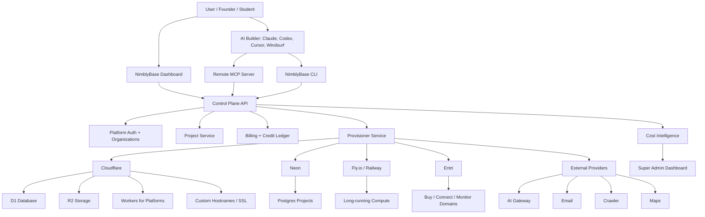

### 5.2 Architecture Principles

- Cloudflare-first for low-cost, high-scale light projects.
- Neon Postgres for production Postgres projects.
- Entri for domain purchase, automatic connection, DNS setup, and monitoring.
- Fly.io or Railway for long-running compute.
- Modular usage, meaning users can bring their own deployment or use only selected NimblyBase services.
- MCP and CLI are first-class product surfaces.
- Every provider action must emit an activity event and usage event.
- Billing must be based on subscription, credits, usage, and add-ons.

---

## 6. Service Catalog

| Service | Required | Default Provider | Pricing Style |
|---|---:|---|---|
| D1 Database | Optional | Cloudflare D1 | Included plus overage |
| Postgres | Optional paid | Neon | Provider cost plus margin |
| Authentication | Optional | NimblyBase Auth | Included by plan limits |
| Storage | Optional | Cloudflare R2 | Included plus GB/operations |
| Edge Functions | Optional | Cloudflare Workers for Platforms | Included plus usage |
| Frontend Deployment | Optional | Workers for Platforms / Static Assets | Included plus usage |
| Container Deployment | Optional add-on | Fly.io first, Railway later | Usage add-on |
| AI APIs | Optional | OpenRouter first, direct providers later | Credit-based |
| Email | Optional | Resend/Postmark first, SES later | Credit-based |
| Web Crawler | Optional | Apify first | Credit-based |
| Maps | Optional | Mapbox + Leaflet | Credit/BYOK |
| Domain Purchase | Optional add-on | Entri Sell | Domain price plus fee |
| Domain Connect | Optional add-on | Entri Connect | Per successful connection |
| Manual Domain DNS | Optional | Cloudflare custom hostname | Free or included |
| External Deploy Support | Optional | User provider | No infra charge from NimblyBase |

---

## 7. Deployment Strategy

NimblyBase should support multiple deployment options. Deployment should not be mandatory. Users can use NimblyBase as only backend services while deploying elsewhere.

### 7.1 Deployment Choice Flow

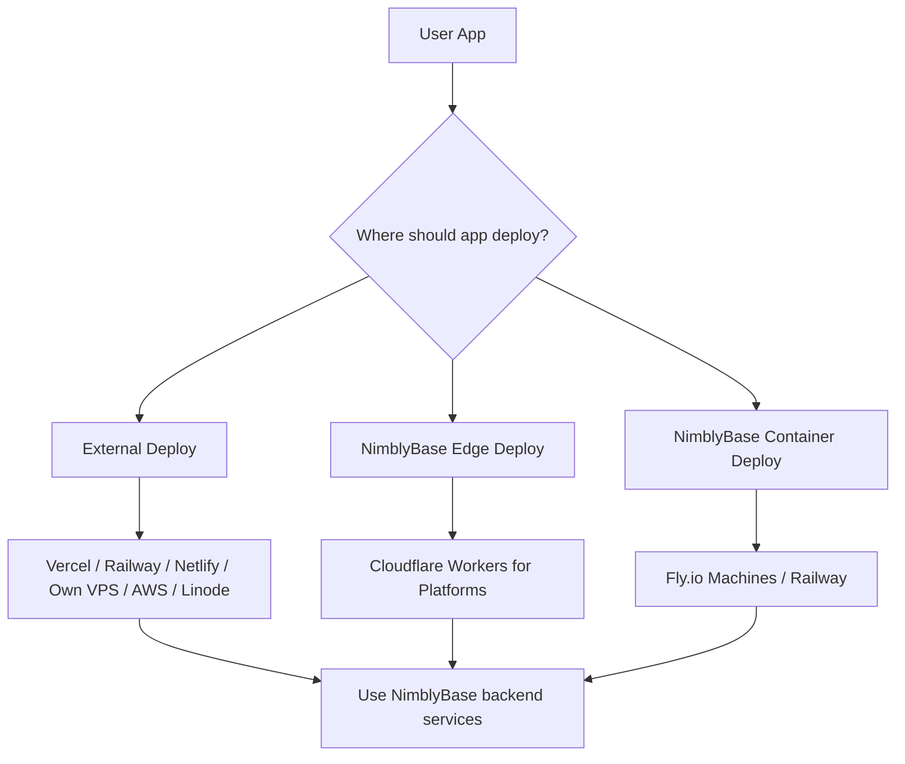

### 7.2 Deployment Rules

- Cloudflare Pages should be used only for NimblyBase-owned websites:
  - Marketing site
  - Documentation site
  - Dashboard shell
  - Internal admin app
- Customer apps should not use one Cloudflare Pages project per app because Pages has project limits.
- Customer static/frontend apps should deploy through Workers for Platforms and static asset delivery.
- Customer edge/API apps should deploy through Workers for Platforms.
- Long-running apps should deploy through Fly.io Machines first.
- Railway can be added later as an alternative container deployment provider.
- User-owned external deployments should always be supported.

### 7.3 Deployment Types

| Deployment Type | Best For | Runtime | Billing |
|---|---|---|---|
| External Deployment | Users with own Vercel/Railway/Netlify/AWS | User provider | User pays provider |
| Edge Frontend Deployment | Vite, React, Astro, static frontend | Cloudflare WFP static assets | Included plus usage |
| Edge Function Deployment | APIs, webhooks, cron, auth hooks | Cloudflare Workers for Platforms | Included plus usage |
| Container Deployment | Docker, Express, FastAPI, queue workers, websockets | Fly.io/Railway | Separate compute add-on |

---

## 8. Domain Service With Entri

NimblyBase should provide a complete domain service:

- Buy new domain
- Connect existing domain
- Automatic DNS setup
- Manual DNS fallback
- SSL issuance
- Domain monitoring
- Renewal and status alerts
- Domain-related billing and usage tracking

### 8.1 Domain Provider

Primary domain automation provider:

> Entri

Entri services to use:

- Entri Sell for embedded domain buying
- Entri Connect for automatic DNS/domain connection
- Webhooks for status updates
- Domain monitoring if available in the selected plan

### 8.2 Domain Flow

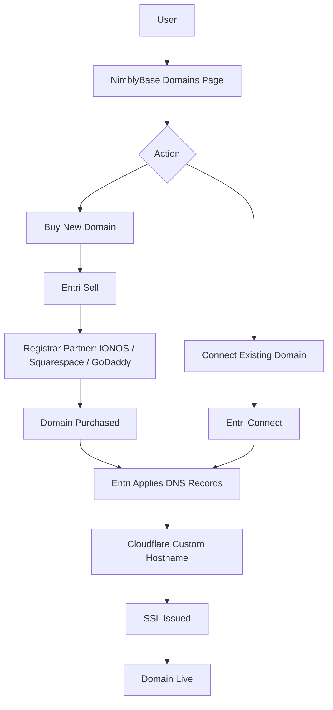

### 8.3 Domain Pricing

Entri starting plan assumption:

| Entri Plan | Cost | Included |
|---|---:|---|
| Startup | $249/month | 600 automatic domain connections/year and 1,200 monitored domains |

Approximate base unit cost:

```text
$249 per month / 600 yearly connections = approximately $0.415 per connection before margin, support, failed attempts, and unused capacity risk
```

Recommended NimblyBase pricing:

| Domain Feature | Suggested Charge |
|---|---:|
| Free project subdomain | Included |
| Manual custom domain | Free on paid plans |
| Entri auto-connect existing domain | $2 per successful connection |
| Buy domain from NimblyBase | Domain price plus $2 to $5 service fee |
| Domain monitoring | $1/domain/month or bundled in Pro/Team |
| Reconnect/change domain | $1 to $2 |
| Agency bulk domain pack | Custom |

### 8.4 Domain Events

Required events:

```text
domain.search.started
domain.purchase.started
domain.purchase.completed
domain.purchase.failed
domain.connection.started
domain.connection.completed
domain.connection.failed
domain.dns.records.applied
domain.verified
domain.ssl.issued
domain.ssl.failed
domain.monitoring.enabled
domain.monitoring.alert
domain.renewal.due
domain.deleted
```

---

## 9. Database Strategy

### 9.1 Database Options

NimblyBase should offer two database modes:

| Mode | Provider | Target User |
|---|---|---|
| Light Database | Cloudflare D1 | Students, hackathons, simple apps, marketing sites, small tools |
| Postgres Database | Neon | Production apps, SaaS, pgvector, relational apps, analytics-heavy apps |

### 9.2 D1 Strategy

- Create one D1 database per project.
- Use D1 for Free, Starter, and Builder plans.
- Provide REST API and SDK access.
- Provide migrations and table management through dashboard, CLI, and MCP.
- Good for small apps and cheap onboarding.

### 9.3 Neon Postgres Strategy

- Use Neon for Pro and Team plans.
- Create one Neon project per NimblyBase customer project for clean isolation.
- Use Neon APIs for project creation, endpoint suspend/reactivate, branches, and monitoring.
- Avoid offering unlimited Neon usage.
- Track Neon storage, compute, egress, and branch usage inside the cost dashboard.

### 9.4 Inactive Project Handling

D1 inactive project:

- Disable public API keys.
- Stop cron jobs/functions.
- Keep D1 data and R2 files.
- Reactivate instantly by re-enabling keys and jobs.

Neon inactive project:

- Suspend Neon endpoint.
- Disable NimblyBase project API.
- Keep data while paid or within retention policy.
- Long inactive projects can be exported to R2 and deleted from Neon.
- Restore by creating a new Neon project and importing backup.

---

## 10. Edge Functions and Compute Strategy

### 10.1 Edge Functions

Edge functions are required for:

- Webhooks
- AI API orchestration
- Payment callbacks
- Auth hooks
- Email workflows
- Scheduled jobs
- Small API endpoints
- Crawler ingestion
- Data transformation

Runtime:

> Cloudflare Workers for Platforms

### 10.2 Edge Function Flow

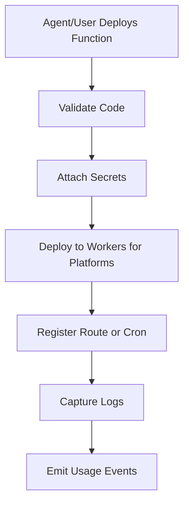

### 10.3 Long-running Compute

Workers should not be used for long-running workloads.

Use Fly.io or Railway for:

- Docker apps
- Persistent Express/FastAPI servers
- Websocket servers
- Long scraping jobs
- Queue workers
- Long-running AI agents
- Background processors

Billing rule:

> Container compute must be a separate usage-based add-on.

---

## 11. MCP and CLI Strategy

MCP and CLI are core product surfaces, not developer extras.

### 11.1 MCP Server

Remote MCP server must allow AI agents to:

- Authenticate with OAuth
- Select organization and project
- Read NimblyBase docs
- Create tables
- Run migrations
- Inspect schema
- Create storage buckets
- Deploy edge functions
- Set secrets
- Read logs
- Check usage
- Deploy frontend
- Connect domain
- Diagnose project issues

Required MCP tools:

```text
get_project
list_projects
create_project
get_backend_metadata
get_api_keys
get_table_schema
run_sql
apply_migration
create_bucket
upload_file
deploy_function
set_secret
get_logs
create_deployment
get_deployment_status
connect_domain
buy_domain
check_domain_status
get_usage
diagnose_project
fetch_docs
```

### 11.2 CLI

CLI package:

```text
npx nimblybase
```

Core commands:

```bash
npx nimblybase login
npx nimblybase whoami
npx nimblybase create
npx nimblybase link
npx nimblybase db status
npx nimblybase db push
npx nimblybase functions deploy
npx nimblybase deploy
npx nimblybase domains connect
npx nimblybase domains buy
npx nimblybase logs
npx nimblybase usage
npx nimblybase diagnose
```

### 11.3 Agent Onboarding UX

Dashboard should show:

```text
Connect your coding agent

Claude Code
Codex
Cursor
Windsurf
VS Code
MCP JSON
CLI
```

Each option should provide:

- install command
- MCP config
- short-lived token
- copy prompt
- verification prompt

---

## 12. Customer Dashboard Requirements

### 12.1 Dashboard Navigation

```text
Overview
Connect Agent
Database
Auth
Storage
Edge Functions
Deployments
AI APIs
Email
Web Scraper
Maps
Domains
Logs
Usage & Billing
Settings
```

### 12.2 Overview Page

Must show:

- Project status
- DB type: D1 or Neon
- Agent connection status
- Deployment status
- Active domains
- Current monthly spend
- Remaining credits
- Recent errors
- Recent activity

### 12.3 Database Page

Must support:

- Table list
- Schema viewer
- SQL/migration runner
- API endpoint examples
- SDK examples
- Usage metrics
- Backup status for Neon

### 12.4 Deployment Page

Must support:

- Frontend deployments
- Edge function deployments
- Container deployments
- Build logs
- Environment variables
- Production URL
- Preview URLs
- Rollback
- Domain routing

### 12.5 Domains Page

Must support:

- Free NimblyBase subdomain
- Buy new domain
- Connect existing domain
- Entri auto-connect
- Manual DNS fallback
- SSL status
- DNS status
- Monitoring alerts
- Domain billing events

---

## 13. Super Admin Dashboard Requirements

The super admin dashboard is required from early product phases because NimblyBase depends on many third-party provider costs.

### 13.1 Admin Navigation

```text
Global Overview
Customers
Projects
Provider Costs
Credit Ledger
Activity Logs
Deployments
Domains
Provisioning Queue
Billing
Abuse and Limits
Support View
Settings
```

### 13.2 Global Overview

Must show:

- Total customers
- Active projects
- Monthly recurring revenue
- Total credits sold
- Total provider cost
- Gross margin
- Cost by provider
- High-risk projects
- Failed provisioning jobs
- Domain failures

### 13.3 Provider Cost View

Providers to track:

- Cloudflare
- Neon
- Entri
- Fly.io
- Railway
- AI provider/OpenRouter
- Email provider
- Apify
- Mapbox
- Stripe

For each provider:

- plan cost
- variable usage cost
- customer revenue tied to provider
- gross margin
- usage trend
- alerts

### 13.4 Customer Cost View

For each customer/project:

| Metric | Description |
|---|---|
| Plan | Current subscription |
| Revenue | Subscription and add-on revenue |
| Provider Cost | Actual third-party cost |
| Credit Usage | Credits consumed |
| Gross Margin | Revenue minus provider cost |
| Risk | High usage, abuse, failed payments, provider errors |

---

## 14. Billing, Credits, and Cost Intelligence

### 14.1 Pricing Model

Use:

```text
Subscription + included credits + usage overage + add-ons
```

### 14.2 Suggested Plans

| Plan | Target | DB | Notes |
|---|---|---|---|
| Free | Students/testing | D1 only | No domain buying, limited services |
| Starter | Simple apps | D1 | Edge deploy, paid Entri add-on |
| Builder | Active builders | D1 | More projects and credits |
| Pro | Real apps | D1 + Neon | Neon, backups, domain buying |
| Team | Agencies/teams | D1 + Neon | Members, multiple projects, bulk domains |
| Compute Add-on | Long-running apps | Any | Fly/Railway billed separately |

### 14.3 Credit Ledger

Every usage event should be normalized into credits.

Examples:

- AI request
- Email sent
- Scraper run
- R2 storage
- D1 usage
- Neon usage
- Edge function invocation
- Container compute
- Domain auto-connect
- Domain monitoring

### 14.4 Cost Flow

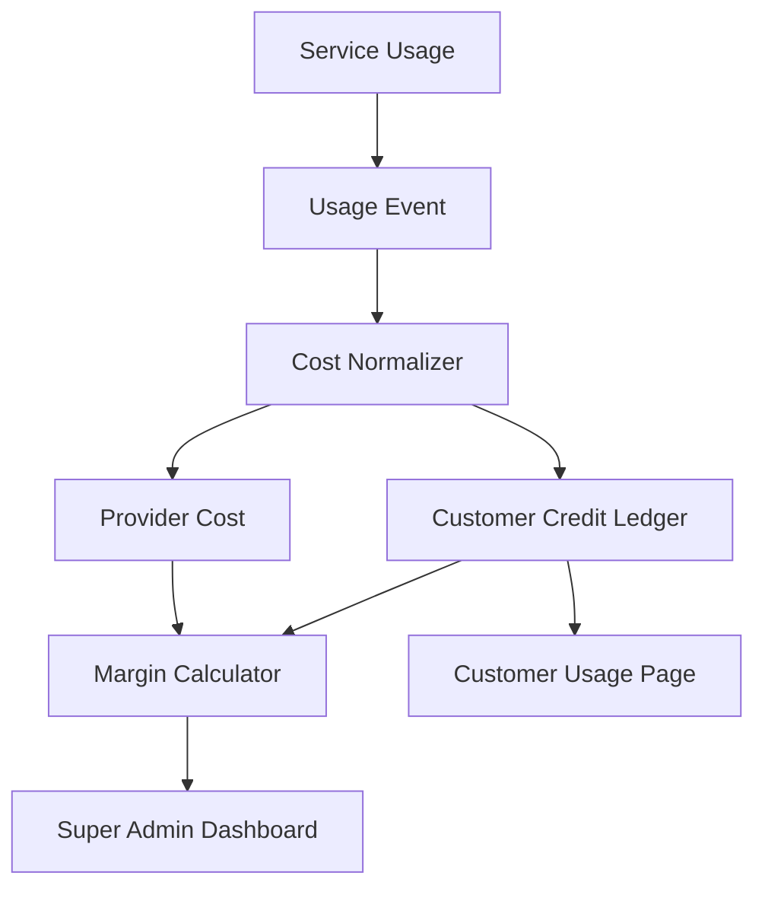

### 14.5 Required Billing Tables

```text
plans
subscriptions
credit_wallets
credit_ledger
usage_events
provider_cost_events
customer_daily_usage
customer_daily_margin
invoices
payment_events
```

---

## 15. Microservice Architecture

### 15.1 Microservice Overview

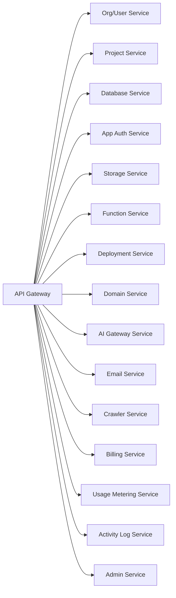

### 15.2 Recommended Implementation Style

Phase 1 should use a modular monolith or service-oriented monorepo, not too many independent deployments.

Recommended stack:

| Area | Stack |
|---|---|
| Backend control plane | TypeScript, Node.js, Fastify or NestJS |
| Frontend dashboard | React, TypeScript, Tailwind |
| Marketing/docs | Astro or Next.js, MDX |
| Internal platform DB | Neon Postgres |
| Queue | Cloudflare Queues |
| Storage | Cloudflare R2 |
| Edge runtime | Cloudflare Workers |
| CLI | TypeScript npm package |
| MCP | TypeScript remote MCP server |

---

## 16. Microservice Flows

### 16.1 Project Provisioning Flow

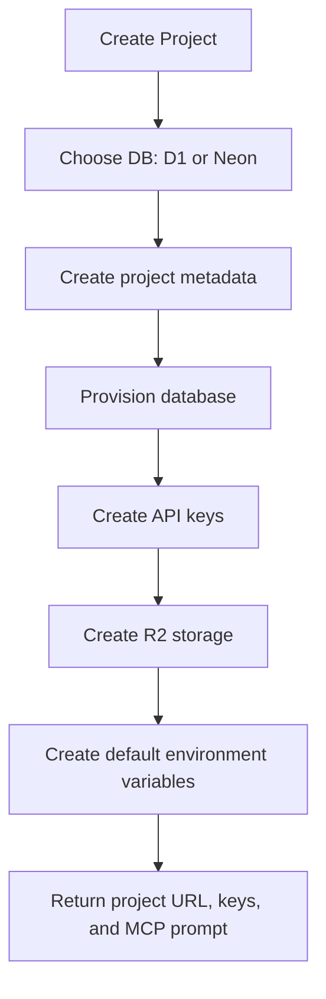

### 16.2 Database Request Flow

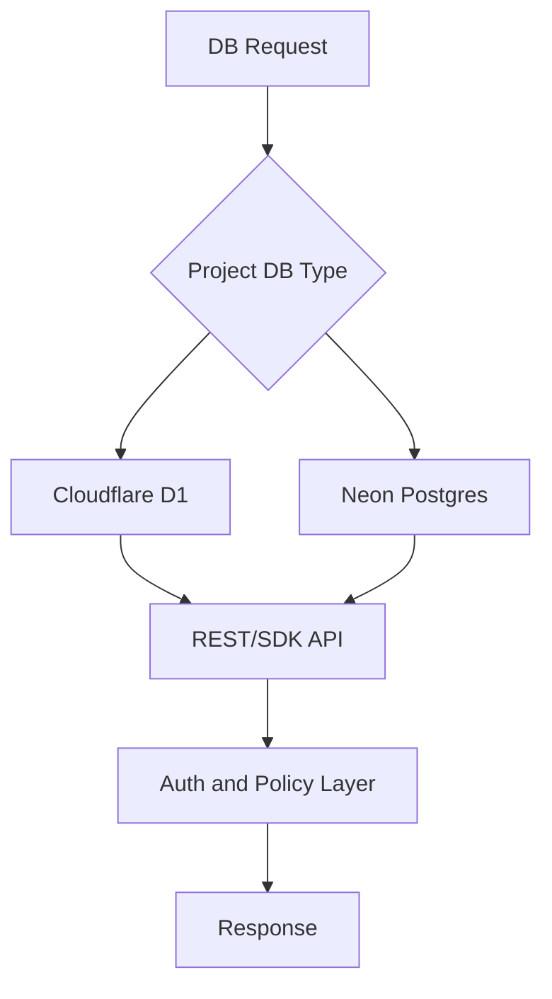

### 16.3 Deployment Flow

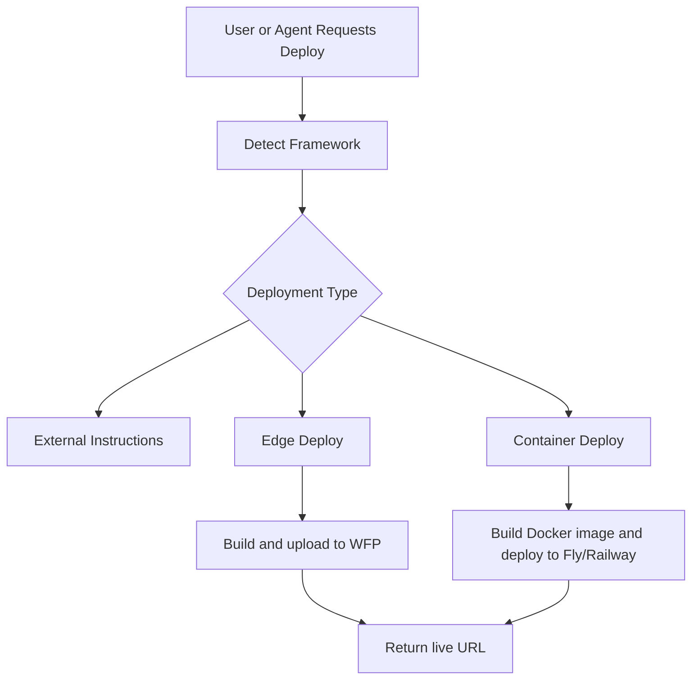

### 16.4 Domain Flow

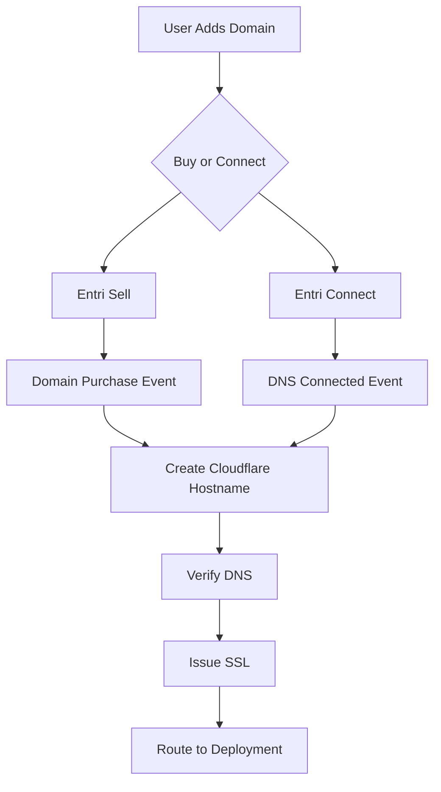

### 16.5 Activity Logging Flow

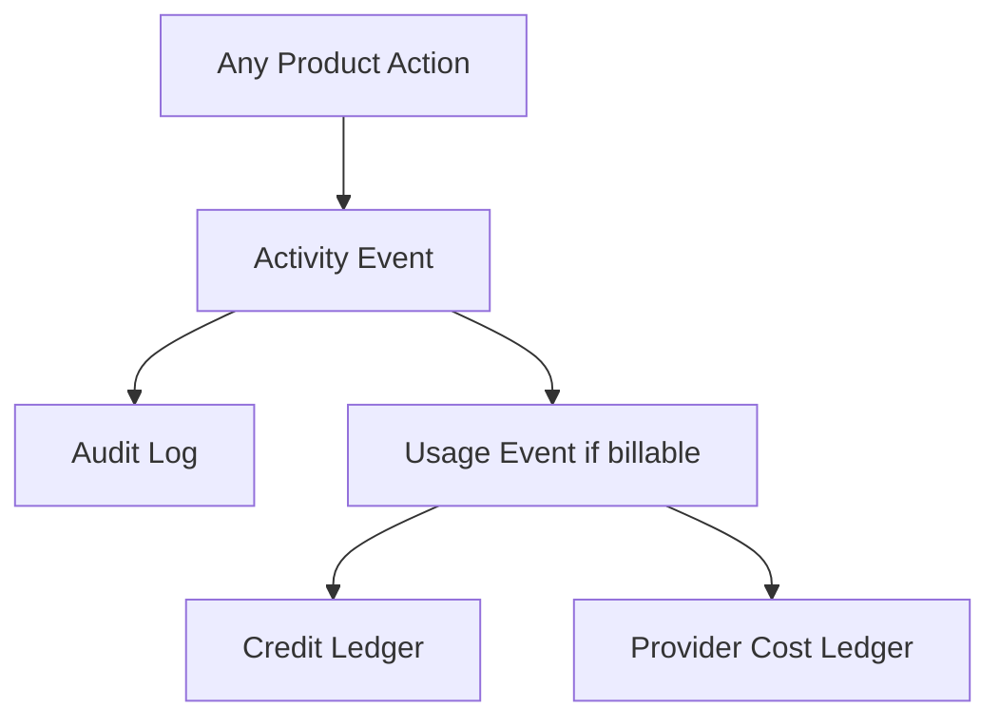

---

## 17. Security Requirements

Required:

- OAuth login for dashboard
- OAuth for remote MCP
- Short-lived agent tokens
- Project-level anon keys
- Project-level service keys
- API key rotation
- Encrypted provider credentials
- Encrypted user secrets
- Audit logs
- Rate limits by IP, org, project, key, and service
- Abuse detection
- Secret scanning in CI
- No service keys in frontend
- Strict separation between NimblyBase platform data and customer project data

---

## 18. Reliability and Scalability Requirements

Required:

- Idempotent provisioning jobs
- Queue-based provider operations
- Retry handling for Cloudflare, Neon, Entri, Fly, and email providers
- Webhook replay support
- Usage event replay support
- Backups for paid Postgres projects
- Project suspend/reactivate lifecycle
- Domain monitoring and SSL failure alerts
- Cost anomaly alerts
- Graceful degradation when optional providers fail

---

## 19. Design System and Brand Direction

### 19.1 Brand Direction

Visual direction:

- Dark-first developer infrastructure product
- Mint green primary color
- Clean, sharp, premium, agent-native
- Inspired by strong modern SaaS storytelling, but not copied from any site

### 19.2 Suggested Palette

| Token | Color |
|---|---|
| Background | `#050807` |
| Surface | `#0B1110` |
| Surface 2 | `#111A17` |
| Border | `#1D2A25` |
| Primary Green | `#35F6A3` |
| Deep Green | `#0F3D2E` |
| Text | `#F4FFF9` |
| Muted Text | `#8DA39A` |
| Amber Alert | `#F6B44B` |
| Red Alert | `#FF5C72` |
| Cyan Accent | `#5AD7FF` |

### 19.3 Logo Direction

Recommended logo:

> Geometric stacked N mark in mint green.

Meaning:

- N for NimblyBase
- Base blocks for backend infrastructure
- Agent-ready modular platform

---

## 20. Marketing Site Requirements

Marketing site sections:

1. Hero with app idea input
2. Live backend provisioning mock
3. AI agent connection demo
4. Service grid
5. D1 Light vs Neon Postgres explanation
6. Deployment options
7. Domains through NimblyBase
8. Cost-safe credits explanation
9. Pricing
10. Docs and quickstart
11. FAQ

Hero copy:

```text
Your AI agent can build the app.
NimblyBase gives it the backend.

Database, auth, storage, AI APIs, email, edge functions, domains, and deployment.
Provisioned in minutes. Controlled by MCP, CLI, or dashboard.
```

---

## 21. Documentation Requirements

Docs structure:

```text
getting-started/
  overview
  create-project
  connect-claude
  connect-codex
  connect-cursor
  connect-windsurf

core-concepts/
  projects
  api-keys
  credits
  d1-database
  postgres-neon
  auth
  storage
  edge-functions
  deployment
  domains
  ai-gateway
  email
  crawler
  maps

cli/
  install
  login
  project
  db
  functions
  deploy
  domains
  logs

mcp/
  overview
  tools
  oauth
  claude-code
  codex
  cursor
  windsurf

guides/
  build-saas
  build-marketing-site
  add-login
  upload-images
  send-email
  use-ai-api
  deploy-function
  buy-domain
  connect-domain

billing/
  plans
  credits
  usage-limits
  add-ons

reference/
  rest-api
  sdk
  errors
  webhooks
```

---

## 22. GitHub, CI/CD, and Engineering Process

### 22.1 Repository Structure

```text
nimblybase/
  apps/
    marketing/
    dashboard/
    docs/
    control-plane-api/
    mcp-server/
    admin/
  packages/
    cli/
    sdk-js/
    shared-types/
    ui/
    config/
  infra/
    cloudflare/
    neon/
    terraform/
  docs/
```

### 22.2 CI/CD Requirements

Required checks:

- TypeScript typecheck
- ESLint
- Prettier
- Unit tests
- API contract tests
- MCP tool schema validation
- CLI command tests
- Dashboard Playwright smoke tests
- Secret scanning
- Dependency audit
- Build verification

Branch rules:

- `main` is production
- `develop` is staging
- PR required before merge
- No direct push to `main`
- Preview deployments for PRs
- Migration review before production deploy

---

## 23. Sprint Plan

### Sprint 0: Foundation

- Finalize brand and domain
- Create GitHub org and monorepo
- Setup CI/CD
- Setup Cloudflare, Neon, Stripe, Sentry, PostHog
- Define platform DB schema
- Create design system tokens

### Sprint 1: Control Plane

- User authentication
- Organizations
- Projects
- Project keys
- Credit ledger
- Usage events
- Basic customer dashboard

### Sprint 2: D1 and R2 Core

- D1 provisioning
- D1 schema/migration flow
- REST API over D1
- R2 storage
- Upload/download APIs
- Pause/reactivate flow

### Sprint 3: MCP and CLI

- Remote MCP server
- OAuth flow
- CLI login/link/create
- DB tools
- Logs and usage tools
- Agent connect dashboard page

### Sprint 4: Edge Deployment

- Workers for Platforms setup
- Frontend/static deployment
- Edge function deployment
- Secrets
- Environment variables
- Deployment logs
- Rollback

### Sprint 5: Auth and Email

- Customer app auth
- Signup/login/forgot password
- Email templates
- Email provider integration
- Email usage metering

### Sprint 6: Neon Postgres

- Neon project provisioning
- Postgres connection and metadata
- Suspend/reactivate
- pgvector support
- Backups
- Usage metering

### Sprint 7: Domains With Entri

- Entri Sell
- Entri Connect
- Entri webhooks
- Cloudflare custom hostname
- SSL status
- Domain monitoring
- Domain billing events

### Sprint 8: Super Admin

- Provider cost dashboard
- Customer cost explorer
- Margin reporting
- Activity logs
- Provisioning queue monitor
- Entri, Neon, Cloudflare, Fly usage
- Support controls

### Sprint 9: Marketing and Docs

- Marketing site
- Pricing page
- Docs site
- Quickstarts
- Agent connection guides
- Domain/deployment guides
- Example app templates

---

## 24. Acceptance Criteria

NimblyBase v1 is acceptable when:

- User can sign up and create an organization.
- User can create a project.
- User can choose D1 database.
- User can connect Claude/Codex/Cursor through MCP or CLI.
- Agent can create database schema.
- Agent can deploy an edge function.
- User can upload files to storage.
- User can view logs and usage.
- User can deploy a frontend/edge app through NimblyBase.
- User can use external deployment while keeping NimblyBase backend.
- User can connect an existing domain through Entri.
- User can buy a domain through the embedded domain flow if enabled.
- Cloudflare custom hostname and SSL flow works.
- Usage events and credit ledger work.
- Super admin can see customer cost, provider cost, margin, and activity logs.
- Docs explain setup clearly for non-experts.

---

## 25. Open Decisions

| Decision | Options | Recommendation |
|---|---|---|
| Backend framework | Fastify, NestJS, Hono | Fastify or NestJS for control plane |
| Marketing/docs | Astro, Next.js | Astro for docs/marketing simplicity |
| Dashboard | Vite React, Next.js | React + Vite or Next.js |
| Container provider | Fly.io, Railway | Fly.io first, Railway later |
| Email provider | Resend, Postmark, SES | Resend/Postmark first, SES later |
| AI provider | OpenRouter, direct providers | OpenRouter first |
| Domain merchant-of-record | Entri/registrar checkout, own registrar reseller | Start with Entri embedded checkout |
| Pricing credits | $1 = 100 credits or $1 = 1 credit | Use simple dollar-equivalent display for users |

---

## 26. Final Recommendation

Build NimblyBase as a modular, Cloudflare-first backend and deployment platform with Neon Postgres upgrades, Entri-powered domains, and strong cost intelligence.

The product should not force users to deploy everything on NimblyBase. It should allow users to bring their own Vercel, Railway, Netlify, AWS, or VPS while using NimblyBase for backend services.

The strongest product experience should be:

1. User creates project.
2. User connects AI agent.
3. AI agent provisions backend.
4. User deploys frontend or uses external deployment.
5. User buys or connects domain.
6. NimblyBase tracks cost, usage, logs, and margin.

Final product promise:

> NimblyBase helps AI builders go from prompt to production with backend, deployment, domains, and cost control in one platform.
